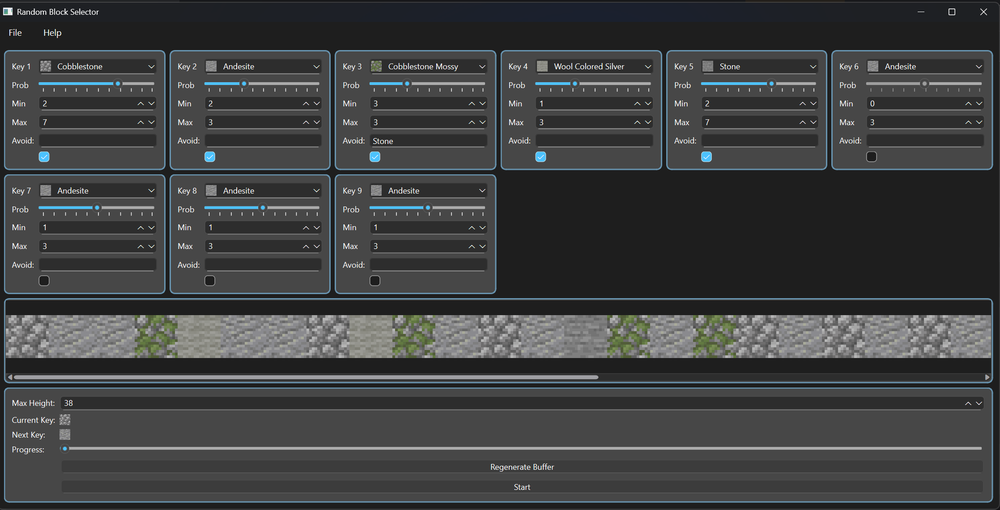

# random-key
App to generate a random sequence of key presses using rules and probabilities.
Helps to create a variety of texture palettes. Great for adding texture to
builds when building vertically. Simply jump and place and this app will cycle through
the palette.



## How to use

Each Item is bound to a num key (1-9), Assign a block to match the item in your
hotbar location.

When activated with `Start` the app will listen for right clicks (Place item), when
pressed the app will select the next item in the hotbar.

The preview bar can be used to try different palette combinations.

### Parameters
+ Prob: How often it'll appear.
+ Min: How likely this will occur in sequence
+ Max: How many this will occur in sequence
+ Avoid: Name of the item, that it should avoid being next to.
+ Max Height: How long the sequence should be.

## Sessions
The current can be saved from File -> Save. Settings are restored on launch.

# Dev
Activate the conda env using the `environment.yml` to install python and packages.

To build the app as executable run

``` text
build.bat
```


